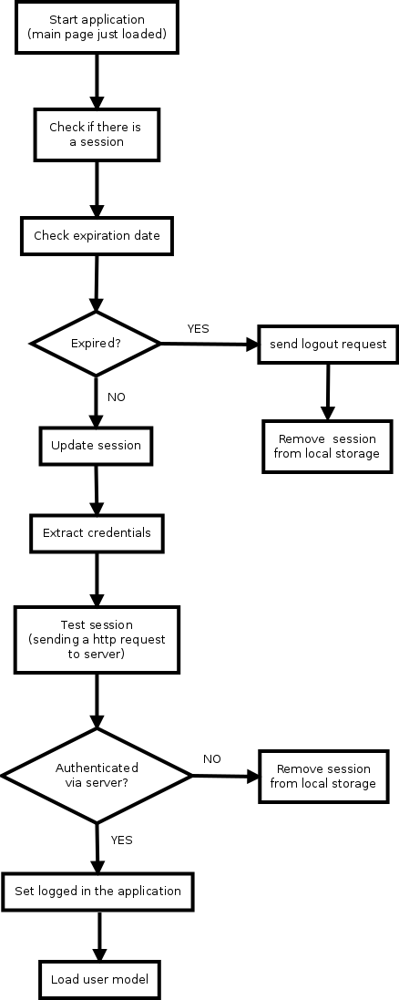

AJS web-client
=====

# Content
Tips, notes and fast description of AJS web client aspects.

# WMS configuration
Map layers configuration is present in the file [appconfig.json](https://github.com/SentinelDataHub/DataHubSystem/blob/master/client/webclient/src/main/frontend/app/config/appconfig.json#L55)

The map key contains configurations to set the "Satellite", "Road" and "Hybrid" layers.
For each layer is possible to define the OpenLayers source class ([list]( http://openlayers.org/en/v3.6.0/apidoc/ol.source.html) ) and the parameters of the class constructor (depends of the source class).

An example of WMS configuration for the Road layer follows,  inspired by this [example](https://openlayers.org/en/latest/examples/wms-tiled.html):

```
"Road":{
  "sources":[{
    "class":"TileWMS",
    "params":{
      url: 'https://ahocevar.com/geoserver/wms',
      params: {'LAYERS': 'topp:states', 'TILED': true},
      serverType: 'geoserver'
     }
  }],
  "title": "Road",
  "type":"base",
  "visible":true
}
```
# Client side-session management
The web session is managed client-side following the following diagram, at application init (main page loading):



"Update session" means update the expiration date of the session (to keep alive while the user uses the application).

For each http request the session will be updated.
